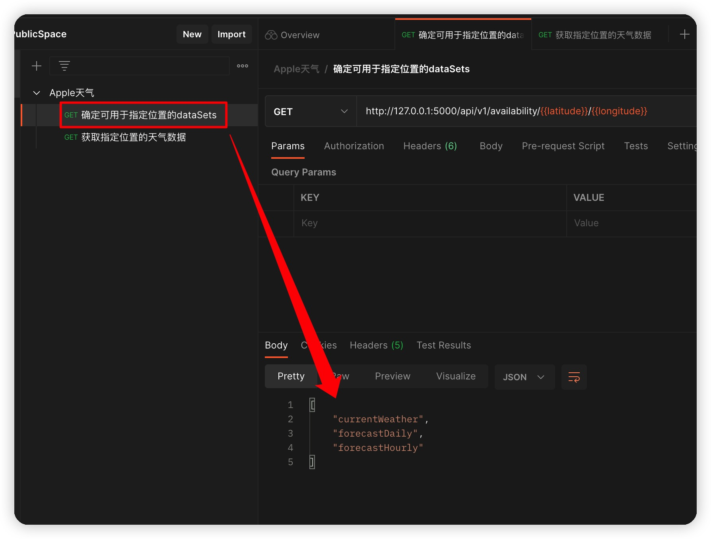
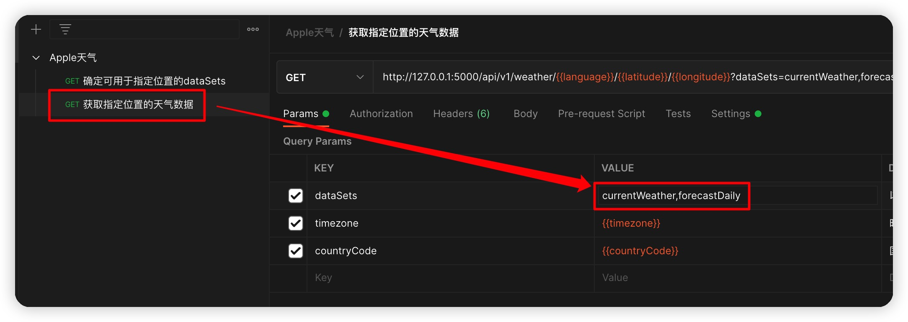

> 增加接口ing
## 使用

### 1.下载本项目

```
git clone https://github.com/cnatom/ByteDanceCampusWeatherServer.git
```

### 2.导入依赖包

```
pip install -r requirements.txt
```

### 3.启动服务
运行`app.py`文件

### 4.调试
[](https://app.getpostman.com/run-collection/10327528-6dbd0332-15b4-44ef-876b-63b3a12ab35a?action=collection%2Ffork&collection-url=entityId%3D10327528-6dbd0332-15b4-44ef-876b-63b3a12ab35a%26entityType%3Dcollection%26workspaceId%3D22ac44d8-23d6-41c5-9279-4254c56a60af)

> 该Postman集合的内容实时更新

## 请求顺序

### 1.获取dataSets可用参数





### 2.在天气接口中获取指定数据




> dataSets的值要以","分隔
